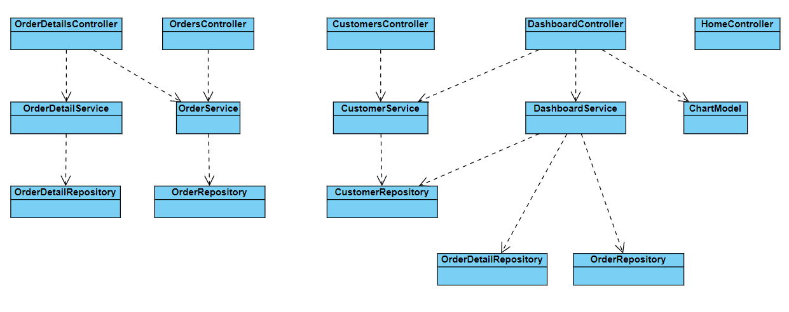

# LabProject
This project is intended for laboratory purposes only

Si CustomerRepository.GetByIdAsync devuelve -1 es que no existe la entidad con ese id
De manera análoga, el método OrderRepository.GetByIdAsync devuelve -1 si no encuentra
orden por el id indicado.
En cuanto a OrderDetailRepository en el método OrderDetailRepository.GetByIdAsync devolverá
Guid.Empty si no encuentra un detalle de orden por el id especificado.

Añadido en ErrorVieModel la propiedad ErrorMessage para poder pasarla a la vista y mostrarla en caso de error.

Los colores del Pie Chart se seleccionan de un array predeterminado de colores. Si el gráfico tiene más categorias 
que colores disponibles se reutilizan los colores a partir del primero, esto es así porque se usa una operación módulo
para seleccionar la posición del color a utilizar.

Para generar el gráfico se ha usado Chart.js, los datos del gráfico se generan llamando desde la vista con JQuery al método 
topItemsSoldChartData de DashboardController

Para inicializar y crear las tablas de la base de datos por primera vez ejecutar desde 
la consola del Gestor de Paquetes los comandos siguientes: 
	- Update-Database -Context SalesContext
	- Update-Database -Context CustomersContext

En la carpeta de Models se han añadido modelos auxiliares:
	- Sales/CustomerOrdersCost --> representa el gasto total de un cliente
	- Sales/ItemSold --> representa el número de unidades ventidas de un producto
	- ChartJS/ChartModel --> se utiliza para poder pintar en la vista el Pie Chart usando ChartJS
	- Dashboard/Dashboard --> se usa para pasar los datos a pintar en la vista Dashboard

Diagrama de clases de los controllers, services y repositories

